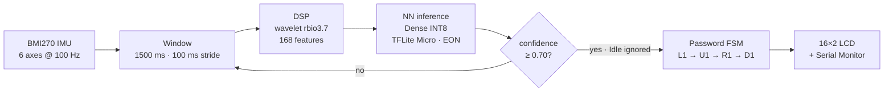

<div align="center">

# TinyGesture

### Gesture-Based Password Authentication on the Arduino Nano 33 BLE Sense Rev2

**Left1 → Up1 → Right1 → Down1** — a four-gesture motion password.
No cloud inference. No phone app. Classification stays on-device.

<br/>


**EE 446: TinyML for Ultra Low-Power Edge Computing** · Summer 2026 · University of Washington
Armina · Rambod · Kourosh

[**Public Edge Impulse project →**](https://studio.edgeimpulse.com/public/1085826/live)

</div>

---

## What it does

The user holds the board and performs four gestures in order. Each 1.5-second window of
six-axis IMU data is classified on-device; a password state machine advances on a correct
gesture, resets on a wrong one, and ignores `Idle`. The result appears on a 16×2 I²C LCD
and over Serial.



| | |
|:--|:--|
| Held-out test accuracy | **97.51%** (weighted F1 0.98) |
| On-device evaluation | **96%** — 72 / 75 trials, 15 per class |
| Peak RAM / flash | **1.5 KB** / **17.6 KB** |
| NN inference | **1 ms** |
| Classes | `Left1` · `Up1` · `Right1` · `Down1` · `Idle` |

`Idle` is a trained class, deliberately recorded to include walking, fidgeting, and
handling the board — not just a resting device.

---

## Hardware

- **Arduino Nano 33 BLE Sense Rev2** — nRF52840, Cortex-M4F @ 64 MHz, 256 KB RAM, 1 MB flash
- **BMI270 IMU** — 3-axis accelerometer + 3-axis gyroscope @ 100 Hz
- **16×2 character LCD** over I²C, address `0x27`, wired to SDA / SCL + 5 V + GND

---

## The deployed model

> [!IMPORTANT]
> The model on the device is **Impulse #1 — Wavelet + Dense, INT8** (deploy version 5).
> Impulse #2 (Raw + 1D CNN) was trained and compared but **never deployed**: 0.92 points
> more accurate, roughly 7× the RAM once quantized.

```text
Window            1500 ms, 100 ms stride, 100 Hz, zero-padded
Scale axes        0.004
Filter            low-pass, cutoff 4.297 Hz, order 6
Features          Wavelet (rbio3.7, level 1) → 168 features, StandardScaler
Classifier        Dense 20 → Dropout 0.25 → Dense 10 → Softmax 5
Training          Adam lr 5e-4, 70 epochs, batch 32, 20% validation
Quantization      INT8 post-training quantization, EON compiler
```

**Latency.** Edge Impulse reports **1 ms** for neural-network inference and an estimated
**≈30 ms** for the complete impulse. On hardware, the gap between end of sampling and the
printed result is roughly **900 ms** — that interval covers the DSP block plus buffer
handling, the LCD update, and Serial output, so it bounds preprocessing and firmware
overhead rather than isolating the DSP block. The measured and estimated figures are
reported separately.

---

## Repository layout

```
├── Compress.ipynb                        compression / architecture-reduction study
├── Personalize.ipynb                     generalization + fine-tuning study
├── ee446_data.py                         data pipeline — CBOR loading, windowing, splits
├── ee-446-final-project-export/          ORIGINAL export — baseline + compression models
├── ei-export-v2/                         later export: same data PLUS 51 newer recordings
├── models/                               trained .h5 models and INT8 .tflite conversions
├── TinyGesture/TinyGesture.ino           deployed firmware
└── EE_446_Final_Project_inferencing.zip  Edge Impulse Arduino library (deploy v5)
```

### The two data exports

| Export | Samples | Role |
|:--|--:|:--|
| `ee-446-final-project-export/` | 1,033 | **Training data.** Every baseline and compression model was trained and tested on this export alone. |
| `ei-export-v2/` | 1,084 | Same project, later — contains **51 recordings made after all models were trained.** |

`Personalize.ipynb` isolates those 51 by diffing sample IDs, then splits them **31 adaptation /
20 evaluation** at the recording level. The 20 evaluation recordings are never trained on by any
model, including the fine-tuned one.

> [!NOTE]
> Thirteen labels exist in the exports; only five are active. The rest (`Circle`, `Square`,
> `Triangle`, `Up`, `Down`, `Left`, `Right`, `testing`) belong to an abandoned earlier gesture
> set and are filtered out by `TARGET_LABELS` in `ee446_data.py`. Of the 1,033 original samples,
> **576 recordings** carry an active label — those are what the train/test split operates on.

### Models

| File | Built by | What it is |
|:--|:--|:--|
| `full_16_32_64.h5` | `Compress.ipynb` | Keras re-implementation of Impulse #2's CNN — 46,805 params |
| `half_8_16_32.h5` | `Compress.ipynb` | width ×0.5 — 21,325 params |
| `quarter_4_8_16.h5` | `Compress.ipynb` | width ×0.25 — 10,217 params |
| `eighth_2_4_8.h5` | `Compress.ipynb` | width ×0.125 — 5,071 params · the accuracy cliff |
| `half_pruned50.h5` | `Compress.ipynb` | half model, 50% magnitude pruning, `strip_pruning` applied |
| `minimal_1conv.h5` | `Compress.ipynb` | single Conv1D(8) + Dense 16 — 5,117 params · best size/accuracy trade |
| `full_finetuned_newdata.h5` | `Personalize.ipynb` | full CNN fine-tuned on **31 of the 51** new recordings; the other 20 held out |
| `*_int8.tflite` | both | INT8 post-training-quantized version of the matching `.h5` |

`models/` also contains files from earlier exploratory work — transfer-learning and
per-subject experiments that were dropped from the project. They are kept for the record
and are **not** produced by either notebook and **not** used by any result in the report.

---

## Setup

```bash
python3.11 -m venv venv && source venv/bin/activate

pip install tensorflow==2.14.1 numpy==1.26.4 cbor2 \
            tensorflow-model-optimization edgeimpulse jupyterlab

jupyter lab      # launch from the repository root
```

> [!WARNING]
> `cbor2` is required, not optional — every sample in both exports is a `.cbor` file and
> `ee446_data.load_export()` cannot read one without it.

Tested on macOS, Python 3.11, TF 2.14.1, NumPy 1.26.4, **CPU only** (the notebooks disable
GPU so results are deterministic). Seeds fixed at `42`. Launch Jupyter from the repository
root so the notebooks find `ee446_data.py` and the export folders.

> [!IMPORTANT]
> **No API key is committed to this repository.** The profiling cells in `Compress.ipynb`
> read one from `~/.ei_api_key`, outside the repo. Every other cell runs without a key, and
> all profiler outputs are already saved in the committed notebooks — you can read the
> results without running those cells. To re-run them: create a development key in Studio
> under **Dashboard → Keys**, then `echo "ei_your_key" > ~/.ei_api_key`.

---

## Running the notebooks

**`Compress.ipynb`** — a few minutes on CPU, plus about a minute per model for profiling.
Loads the original export, windows it at 1500 ms / 100 ms stride, and splits **group-aware**
so every window from one recording stays on the same side. Trains the CNN at full / half /
quarter width plus two probes (eighth width, single-conv "minimal"), converts each to INT8,
applies 50% magnitude pruning to the half model, compares raw vs gzipped size, profiles each
model for the Nano, and prints the summary table behind Table 3.

**`Personalize.ipynb`** — under a minute, no API key. Run **after** `Compress.ipynb`, which
writes the `models/*.h5` files it loads. Isolates the 51 new recordings, splits them 31 / 20,
evaluates every trained model on the 20 unseen ones, fine-tunes the full-width CNN on the 31
(Adam 1e-4, 25 epochs, batch 16), re-measures on both sets to check for catastrophic
forgetting, and confirms INT8 quantization stays lossless.

> [!NOTE]
> **On validation splits.** The held-out *test* set is group-aware, so the reported test
> accuracies are clean. Early stopping during the sweep uses Keras `validation_split=0.15`,
> a random split over windows that does share recordings across the train/validation
> boundary. That affects which epoch's weights were restored — not the reported test figures.

---

## Firmware

<details>
<summary><b>Install, compile, flash</b></summary>

<br/>

1. Delete any existing `~/Documents/Arduino/libraries/EE_446_Final_Project_inferencing` —
   the Arduino IDE silently refuses to overwrite an installed library.
2. **Sketch → Include Library → Add .ZIP Library…**, select
   `EE_446_Final_Project_inferencing.zip`, then restart the IDE.
3. Install `Arduino_BMI270_BMM150` and `LiquidCrystal_I2C` from the Library Manager. The
   sketch derives from Edge Impulse's sensor-fusion example, so `Arduino_LPS22HB`,
   `Arduino_HS300x`, and `Arduino_APDS9960` may also be needed depending on which example
   headers you keep.
4. Open `TinyGesture/TinyGesture.ino`, select **Tools → Board → Arduino Nano 33 BLE** and
   the board's port, then Upload. Serial Monitor at **115200 baud**.

If upload fails with `No device found on cu.usbmodem…`, double-tap reset to enter bootloader
mode (orange LED pulses), re-select the port, upload again. Use a **data-capable** USB cable
plugged directly into the computer — many charge-only extension cables power the board
without ever enumerating it.

</details>

```cpp
#define MAX_ACCEPTED_RANGE  4.0f   // NOT 2.0f — gesture peaks reach ~1.84 g and clip at 2.0
#define CONVERT_G_TO_MS2    9.80665f
#define GESTURE_CONFIDENCE  0.70f
#define EVAL_MODE           0      // 0 = normal operation; 1 = numbered trial logging
```

> [!CAUTION]
> **Units.** `IMU.readAcceleration()` returns **g**; the training data is logged in **m/s²**.
> `poll_acc()` multiplies `data[0..2]` by `CONVERT_G_TO_MS2`; the gyroscope axes are already
> in the training units and are deliberately left alone. Remove this conversion and on-device
> inference collapses even though the model is unchanged — the single largest integration bug
> in the project.

**Clamp order.** `MAX_ACCEPTED_RANGE` is applied **in g, before** the m/s² conversion. Reverse
the order and every reading is silently clipped.

**Idle handling.** `processGesture()` returns immediately on an `Idle` classification. Without
that early return, an Idle window mid-sequence fails the comparison and resets the password.

**Evaluation mode.** `EVAL_MODE 1` bypasses the password state machine and prints one numbered
line per window. That is how the 75-trial on-device evaluation was collected. Set it back to
`0` for the demo.

---

## Where the report's numbers come from

| Report table | Source |
|:--|:--|
| **Table 1** — baseline model performance | Studio: Impulse #1 and #2 model-testing pages |
| **Table 2** — compression / deployment tradeoffs | Studio Deployment page, float32 and INT8 variants |
| **Table 3** — width sweep × PTQ × pruning | `Compress.ipynb`, final summary cell |
| **Tables 4 and 5** — on-device evaluation | 75 live trials on the board with `EVAL_MODE 1`, 15 per class, from the Serial log |
| **§6.3** — generalization and fine-tuning | `Personalize.ipynb` |

Table 3 uses our own group-aware split; Tables 1 and 2 use Edge Impulse's split, so small
differences between them are expected and comparisons across the two are approximate.

---

## License and attribution

Firmware derives from Edge Impulse's sensor-fusion example for the Arduino Nano 33 BLE Sense.
The bundled `EE_446_Final_Project_inferencing` library is generated by Edge Impulse Studio and
carries its own license (3-clause BSD).

<div align="center">
<br/>

**Armina · Rambod · Kourosh** — EE 446, University of Washington, Summer 2026

</div>
