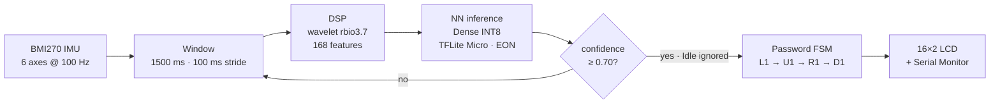

<div align="center">

# TinyGesture

### Gesture-Based Password Authentication on the Arduino Nano 33 BLE Sense Rev2

**Left1 → Up1 → Right1 → Down1** — a four-gesture motion password.
No cloud inference. No phone app. Classification stays on-device.

<br/>


<br/>

**EE 446: TinyML for Ultra Low-Power Edge Computing** · Summer 2026 · University of Washington
Armina · Rambod · Kourosh

[**Public Edge Impulse project →**](https://studio.edgeimpulse.com/public/1085826/live)

</div>

---

## Contents

| | |
|---|---|
| [1. How It Works](#1-how-it-works) | [6. Running Compress.ipynb](#6-running-compressipynb) |
| [2. Hardware](#2-hardware) | [7. Running Personalize.ipynb](#7-running-personalizeipynb) |
| [3. The Deployed Model](#3-the-deployed-model) | [8. Firmware](#8-firmware) |
| [4. Repository Layout](#4-repository-layout) | [9. Where The Report's Numbers Come From](#9-where-the-reports-numbers-come-from) |
| [5. Python Environment](#5-python-environment) | [10. License And Attribution](#10-license-and-attribution) |

---

## 1. How It Works

The user holds the board and performs four gestures in order. Each 1.5-second window of
six-axis IMU data is classified on-device; a password state machine advances on a correct
gesture, resets on a wrong one, and ignores `Idle`. The outcome is shown on a 16×2 I²C LCD
and logged over Serial.



### Results at a Glance

| Metric | Result |
|:--|:--|
| Held-out test accuracy (deployed INT8 model) | **97.51%** — weighted F1 0.98 |
| Physical on-device evaluation | **96%** — 72 / 75 trials, 15 per class |
| Peak RAM | **1.5 KB** |
| Flash | **17.6 KB** |
| Tensor arena | **3,136 B** |
| Neural-network inference | **1 ms** |
| Target | Arduino Nano 33 BLE Sense Rev2 |

**Five classes:** `Left1` · `Up1` · `Right1` · `Down1` · `Idle`
`Idle` is a trained class, deliberately recorded to include walking, fidgeting, and
handling the board — not just a resting device.

---

## 2. Hardware

| Item | Detail |
|:--|:--|
| **Board** | Arduino Nano 33 BLE Sense Rev2 — nRF52840, Cortex-M4F @ 64 MHz, 256 KB RAM, 1 MB flash |
| **Sensor** | BMI270 IMU — 3-axis accelerometer + 3-axis gyroscope @ 100 Hz |
| **Display** | 16×2 character LCD over I²C, address `0x27` |

The LCD is wired to the Nano's I²C pins (SDA / SCL) plus 5 V and GND.

---

## 3. The Deployed Model

> [!IMPORTANT]
> The model running on the device is **Impulse #1 — Wavelet + Dense, INT8** (deploy version 5).
> Impulse #2 (Raw + 1D CNN) was trained and compared but **never deployed**: it is 0.92 points
> more accurate and needs roughly 7× the RAM once quantized.

```text
Window            1500 ms, 100 ms stride, 100 Hz, zero-padded
Scale axes        0.004
Filter            low-pass, cutoff 4.297 Hz, order 6
Features          Wavelet (rbio3.7, level 1) → 168 features, StandardScaler
Classifier        Dense 20 → Dropout 0.25 → Dense 10 → Softmax 5
Training          Adam lr 5e-4, 70 epochs, batch 32, 20% validation
Quantization      INT8 post-training quantization, EON compiler
```

<details>
<summary><b>Verify every value above in three commands</b></summary>

<br/>

```bash
unzip -o EE_446_Final_Project_inferencing.zip -d /tmp/ei

grep -E "DEPLOY_VERSION|LABEL_COUNT|NN_INPUT_FRAME_SIZE|ARENA_SIZE|COMPILED" \
  /tmp/ei/EE_446_Final_Project_inferencing/src/model-parameters/model_metadata.h

sed -n '55,75p' \
  /tmp/ei/EE_446_Final_Project_inferencing/src/model-parameters/model_variables.h
```

Expect: deploy version `5`, label count `5`, input frame `168`, tensor arena `3136` bytes,
`EI_CLASSIFIER_COMPILED 1`, and a DSP block configured as scale-axes `0.004f`, low-pass
`4.296875f` order `6`, analysis-type `"Wavelet"`, `"rbio3.7"`, wavelet-level `1`.

</details>

### Latency

Edge Impulse reports **1 ms** for neural-network inference on the deployed INT8 classifier,
and an estimated **≈30 ms** for the complete impulse (DSP + NN) on this target.

In live firmware testing, the elapsed time between the end of sampling and the printed
classification is approximately **900 ms**. That interval covers everything the firmware does
after the window closes — the wavelet DSP block, buffer handling, the LCD update, and Serial
output — so it bounds preprocessing plus firmware overhead rather than isolating the DSP block
alone. It is an on-hardware observation, not a profiler estimate, and the two figures are
reported separately rather than treated as equivalent.

---

## 4. Repository Layout

```
├── Compress.ipynb                        compression / architecture-reduction study
├── Personalize.ipynb                     generalization + fine-tuning study
├── ee446_data.py                         data pipeline — CBOR loading, windowing, splits
├── ee-446-final-project-export/          ORIGINAL export — baseline + compression models
├── ei-export-v2/                         later export: same data PLUS 51 newer recordings
├── models/                               trained .h5 models and INT8 .tflite conversions
├── evaluation/                           raw 75-trial on-device Serial log (Tables 4 and 5)
├── TinyGesture/TinyGesture.ino           deployed firmware
├── EE_446_Final_Project_inferencing.zip  Edge Impulse Arduino library (deploy v5)
└── report/                               final report PDF
```

### The Two Data Exports

| Export | Samples | Role |
|:--|--:|:--|
| `ee-446-final-project-export/` | 1,033 | **Training data.** Every baseline and compression model in `models/` was trained and tested on this export alone. |
| `ei-export-v2/` | 1,084 | Same project, later. Contains **51 recordings made after all models were trained.** |

`Personalize.ipynb` isolates those 51 by diffing sample IDs, then splits them **31 adaptation /
20 evaluation** at the recording level. The 20 evaluation recordings are never trained on by any
model, including the fine-tuned one.

> [!NOTE]
> **Thirteen labels exist in the exports; only five are active.** The rest belong to an
> abandoned earlier gesture set (`Circle`, `Square`, `Triangle`, `Up`, `Down`, `Left`,
> `Right`, `testing`) and are filtered out by `TARGET_LABELS` in `ee446_data.py`. Of the
> 1,033 original samples, **576 recordings** carry one of the five active labels — those
> are what the train/test split operates on.

### Contents of `models/`

Every file is produced by one of the two notebooks in this repository. Nothing is orphaned.

| File | Built by | What it is |
|:--|:--|:--|
| `full_16_32_64.h5` | `Compress.ipynb` | Keras re-implementation of Impulse #2's CNN — 46,805 params |
| `half_8_16_32.h5` | `Compress.ipynb` | width ×0.5 — 21,325 params |
| `quarter_4_8_16.h5` | `Compress.ipynb` | width ×0.25 — 10,217 params |
| `eighth_2_4_8.h5` | `Compress.ipynb` | width ×0.125 — 5,071 params · **the accuracy cliff** |
| `half_pruned50.h5` | `Compress.ipynb` | half model, 50% magnitude pruning, `strip_pruning` applied |
| `minimal_1conv.h5` | `Compress.ipynb` | single Conv1D(8) + Dense 16 — 5,117 params · **best size/accuracy trade** |
| `full_finetuned_newdata.h5` | `Personalize.ipynb` | full CNN fine-tuned on **31 of the 51** new recordings; the other 20 are held out for evaluation |
| `*_int8.tflite` | both | INT8 post-training-quantized version of the matching `.h5` |

---

## 5. Python Environment

```bash
python3.11 -m venv venv && source venv/bin/activate

pip install tensorflow==2.14.1 numpy==1.26.4 cbor2 \
            tensorflow-model-optimization edgeimpulse jupyterlab
```

> [!WARNING]
> `cbor2` is **required, not optional**. Every sample in both exports is a `.cbor` file and
> `ee446_data.load_export()` cannot read a single one without it.

Tested on macOS, Python 3.11, TensorFlow 2.14.1, NumPy 1.26.4, **CPU only** — the notebooks
call `tf.config.set_visible_devices([], "GPU")` so results are deterministic. Seeds fixed at `42`.

Launch Jupyter **from the repository root** so the notebooks can find `ee446_data.py` and the
export folders:

```bash
jupyter lab
```

### Edge Impulse API Key — Profiling Cells Only

> [!IMPORTANT]
> **No API key is committed to this repository.** The notebook reads one from `~/.ei_api_key`,
> outside the repo. Every other cell runs without a key, and all profiler outputs are already
> saved in the committed notebooks — you can read the results without running these cells at all.

<details>
<summary><b>Setting up a key, if you want to re-run the profiler</b></summary>

<br/>

1. In Edge Impulse Studio: **Dashboard → Keys → Add new API key**, role *Ingestion + deployment*
   (or Admin), and tick **development key** so the key is shown in full.
2. Write it outside the repo:
   ```bash
   echo "ei_your_key_here" > ~/.ei_api_key
   ```
3. Verify:
   ```bash
   head -c 6 ~/.ei_api_key      # should print "ei_" plus a few characters
   ```

</details>

---

## 6. Running Compress.ipynb

Run top to bottom. Roughly a few minutes on CPU, plus about a minute per model for profiling.

| # | Step |
|--:|:--|
| 1 | Loads `ee-446-final-project-export/` and windows it — 1500 ms / 100 ms stride |
| 2 | Splits **group-aware**: every window from one recording stays on the same side, so overlapping windows cannot leak |
| 3 | Trains the CNN at full / half / quarter width, plus two probes (eighth width, single-conv "minimal") |
| 4 | Converts every model to INT8 via post-training quantization and re-evaluates |
| 5 | Applies 50% magnitude pruning to the half model, strips it, re-quantizes |
| 6 | Compares raw vs gzipped file size — where pruning actually pays off |
| 7 | Profiles each INT8 model for the Nano via the Edge Impulse SDK |
| 8 | Prints the final summary table |

> [!NOTE]
> **On validation splits.** The held-out *test* set is group-aware, so the reported test
> accuracies are clean. Early stopping during the sweep uses Keras `validation_split=0.15`,
> a random split over windows that does share recordings across the train/validation boundary.
> That affects which epoch's weights were restored — not the reported test figures.

---

## 7. Running Personalize.ipynb

Run top to bottom **after** `Compress.ipynb`, which writes the `models/*.h5` files this
notebook loads. Well under a minute; no API key required.

| # | Step |
|--:|:--|
| 1 | Loads both exports and isolates the 51 recordings present only in `ei-export-v2/` |
| 2 | Splits them **31 adapt / 20 evaluate**, at the recording level |
| 3 | Evaluates every trained model on the 20 unseen recordings — does model size affect generalization? |
| 4 | Fine-tunes the full-width CNN on the 31 adaptation recordings (Adam 1e-4, 25 epochs, batch 16) |
| 5 | Re-measures on **both** the 20 held-out recordings and the original test set — catastrophic-forgetting check |
| 6 | Quantizes the fine-tuned model to INT8 and confirms accuracy is preserved |

---

## 8. Firmware

<details>
<summary><b>Installing the Edge Impulse library</b></summary>

<br/>

1. Delete any existing `~/Documents/Arduino/libraries/EE_446_Final_Project_inferencing`
   folder — the Arduino IDE silently refuses to overwrite an installed library.
2. **Sketch → Include Library → Add .ZIP Library…** and select
   `EE_446_Final_Project_inferencing.zip` from this repository.
3. Restart the Arduino IDE — it caches the library index.
4. Verify the right model is installed:
   ```bash
   grep "DEPLOY_VERSION\|LABEL_COUNT" \
     ~/Documents/Arduino/libraries/EE_446_Final_Project_inferencing/src/model-parameters/model_metadata.h
   ```
   Expect `EI_CLASSIFIER_PROJECT_DEPLOY_VERSION 5` and `EI_CLASSIFIER_LABEL_COUNT 5`.

Also install `Arduino_BMI270_BMM150` and `LiquidCrystal_I2C` from the Library Manager. The
sketch derives from Edge Impulse's sensor-fusion example, so depending on which example
headers you keep, `Arduino_LPS22HB`, `Arduino_HS300x`, and `Arduino_APDS9960` may also be
needed to compile.

</details>

<details>
<summary><b>Compiling and flashing</b></summary>

<br/>

Open `TinyGesture/TinyGesture.ino`, select **Tools → Board → Arduino Nano 33 BLE** and the
board's serial port, then Upload. Open the Serial Monitor at **115200 baud** to watch
classifications.

If the upload fails with `No device found on cu.usbmodem…`, double-tap the board's reset
button to enter bootloader mode (the orange LED pulses), re-select the port, and upload again.

Use a **data-capable** USB cable connected directly to the computer — many charge-only
extension cables will power the board without ever enumerating it.

</details>

### Four Details That Matter

```cpp
#define MAX_ACCEPTED_RANGE  4.0f   // NOT 2.0f — gesture peaks reach ~1.84 g and clip at 2.0
#define CONVERT_G_TO_MS2    9.80665f
#define GESTURE_CONFIDENCE  0.70f
#define EVAL_MODE           0      // 0 = normal password operation; 1 = evaluation logging
```

> [!CAUTION]
> **Units.** `IMU.readAcceleration()` returns **g**; the training data is logged in **m/s²**.
> `poll_acc()` multiplies `data[0..2]` by `CONVERT_G_TO_MS2`. Gyroscope axes are already in the
> training units and are deliberately left alone. Remove this conversion and on-device inference
> collapses even though the model is unchanged — this was the single largest integration bug in
> the project.

**Clamp order.** The clamp to `MAX_ACCEPTED_RANGE` is applied **in g, before** the m/s²
conversion. Reverse the order and every reading is silently clipped.

**Idle handling.** `processGesture()` returns immediately on an `Idle` classification. Without
that early return, an Idle window mid-sequence fails the comparison and resets the password.

**Evaluation mode.** `EVAL_MODE 1` bypasses the password state machine and prints one numbered
line per window — `EVAL TRIAL n -> <label> (confidence%)`. That is how the 75-trial on-device
evaluation in `evaluation/` was collected. Set it back to `0` for the demo.

---

## 9. Where The Report's Numbers Come From

| Report table | Source |
|:--|:--|
| **Table 1** — baseline model performance | Studio: Impulse #1 and #2 model-testing pages ([public link](https://studio.edgeimpulse.com/public/1085826/live)) |
| **Table 2** — compression / deployment tradeoffs | Studio Deployment page, float32 and INT8 variants of both impulses |
| **Table 3** — width sweep × PTQ × pruning | `Compress.ipynb`, final summary cell |
| **Table 4** — systematic on-device evaluation | `evaluation/on_device_75_trials.csv` — 75 trials, 15 per class |
| **Table 5** — 10 representative instances | `evaluation/on_device_serial_log.txt` — the raw log the CSV was transcribed from |
| **§6.3** — generalization and fine-tuning | `Personalize.ipynb`, cells 4–6 |

> [!NOTE]
> Table 3 uses our own group-aware split; Tables 1 and 2 use Edge Impulse's split. Small
> differences between them are expected and comparisons across the two are approximate.

---

## 10. License And Attribution

Firmware derives from Edge Impulse's sensor-fusion example for the Arduino Nano 33 BLE Sense.
The bundled `EE_446_Final_Project_inferencing` library is generated by Edge Impulse Studio and
carries its own license (3-clause BSD).

<div align="center">
<br/>

Coursework by **Armina · Rambod · Kourosh**
EE 446 — TinyML for Ultra Low-Power Edge Computing
University of Washington, Summer 2026

</div>
